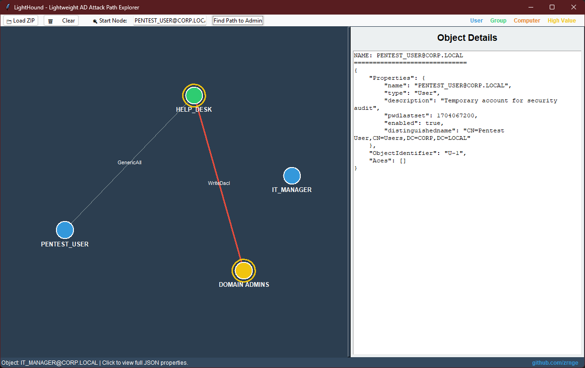

# 🛡️ LightHound




LightHound is a lightweight, standalone Active Directory (AD) attack path visualizer. It provides a simple, interactive GUI to analyze SharpHound JSON exports without the need for Neo4j, Java, or complex database configurations.

✨ Features

- Interactive Graph Engine: Drag nodes to reorganize, scroll to zoom, and right-click to pan.

- DACL Awareness: Automatically parses permissions like GenericAll, WriteDacl, Owns, and more.

- Shortest Path Analysis: One-click pathfinding from any user to the "Domain Admins" group.

- Deep Detail Panel: Click any node to see the full raw JSON data collected by SharpHound.

- Zero Dependencies: Built entirely with standard Python libraries (tkinter, json, zipfile).

## Color Coded:

  - 🔵 Users

  - 🟢 Groups

  - 🟠 Computers

  - 🟡 High Value (Tier 0)

---
# 🚀 Getting Started

Prerequisites

Python 3.x

Installation

1. Clone the repository:
```bash
git clone https://github.com/zrnge/LightHound.git
cd LightHound
```

2. Run the application:
```bash
python lite_hound.py
```

---
# 🛠️ Usage

1. Run SharpHound on a target domain to generate a .zip export.

2. Open LightHound and click 📁 Load ZIP.

3. Use the search bar or click a node to find the shortest path to Domain Admins.

4. Explore the Object Details panel on the right for forensic-level inspection.


# 🤝 Contributing

Contributions, issues, and feature requests are welcome! Feel free to check the <a herf="https://www.google.com/search?q=https://github.com/zrnge/LightHound/issues">issues page</a>.

# 👤 Author

Zrnge

GitHub: @zrnge

# 📜 License

This project is licensed under the MIT License.
